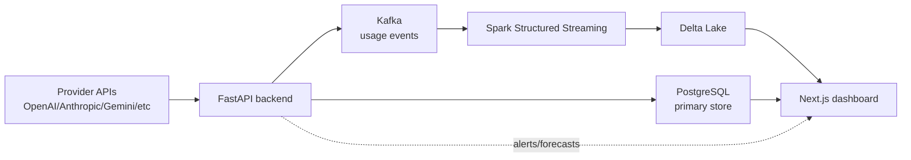

# AI Cost Intelligence Platform

Self-hosted platform for tracking, forecasting, and alerting on LLM API spend across providers (OpenAI, Anthropic, Gemini, Azure OpenAI, AWS Bedrock). Runs locally via Docker Compose, with real provider API integrations rather than mocked data.

## Why this exists

LLM costs are easy to lose track of once you're calling multiple providers across multiple projects — pricing differs by model and token type, and most teams find out they overspent at the end of the month rather than in real time. This platform ingests usage events as they happen, streams them through Kafka/Spark, and surfaces cost, forecasts, and alerts before the bill arrives.

## Architecture



| Component | Role |
|---|---|
| FastAPI backend | Auth, cost ingestion, forecasting, alert rules, recommendations API |
| Kafka | Buffers usage events from each provider integration |
| Spark Structured Streaming | Aggregates events into Delta Lake for historical analysis |
| PostgreSQL | Primary store for accounts, alert configs, recent cost data |
| Next.js frontend | Dashboard, analytics views, forecasting charts, alert management |

## What it actually does right now

- Pulls real usage/cost data from live provider APIs (tested against OpenAI and Anthropic with real keys) — not simulated data
- Streams usage events through Kafka into a Spark job that aggregates spend by provider/model/time window
- Forecasts upcoming spend based on historical usage trends
- Triggers alerts when spend crosses a configured threshold
- Runs entirely on a local machine via `docker-compose up` — no cloud account required to try it

> This is a local-only build at this stage — the Terraform/EKS/MSK config in `infrastructure/` is the deployment target, not something currently running live. If you want to actually run this against your own API keys, see Quick Start below.

## Quick start

```bash
git clone https://github.com/vasudev-rao/ai-cost-platform.git
cd ai-cost-platform
cp .env.example .env
# Add your OpenAI/Anthropic API keys to .env
docker-compose up -d
```

| Service | URL |
|---|---|
| Frontend | http://localhost:3000 |
| API docs (FastAPI/Swagger) | http://localhost:8000/docs |
| Grafana | http://localhost:3001 |

## Tech stack

| Layer | Technology |
|---|---|
| Frontend | Next.js 15, TypeScript, TailwindCSS, ShadCN UI, Recharts |
| Backend | FastAPI, Python 3.12, SQLAlchemy, Alembic |
| Streaming | Apache Kafka, Spark Structured Streaming |
| Data platform | Delta Lake |
| Database | PostgreSQL 16 |
| Monitoring | Prometheus, Grafana |
| Deployment target (not yet live) | AWS (EKS, RDS, S3, MSK), Terraform, Kubernetes, Helm |

## Documentation

- [Architecture Guide](docs/architecture.md)
- [API Reference](docs/api.md)
- [Data Engineering](docs/data-engineering.md)
- [Deployment Guide](docs/deployment.md)
- [Development Guide](docs/development.md)

## Next steps

- [ ] Deploy to AWS (the Terraform config exists but hasn't been applied yet)
- [ ] Add screenshots of the dashboard and a sample cost forecast to this README
- [ ] Add Gemini, Azure OpenAI, and Bedrock integrations (currently OpenAI + Anthropic)
- [ ] Add automated tests for the cost-aggregation Spark job

## License

MIT License — Copyright 2025 Vasudev Rao
